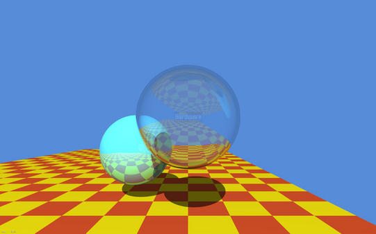
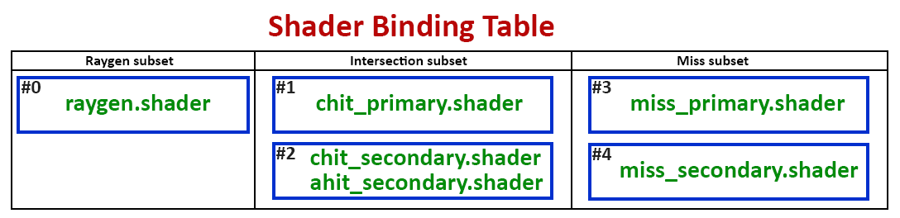
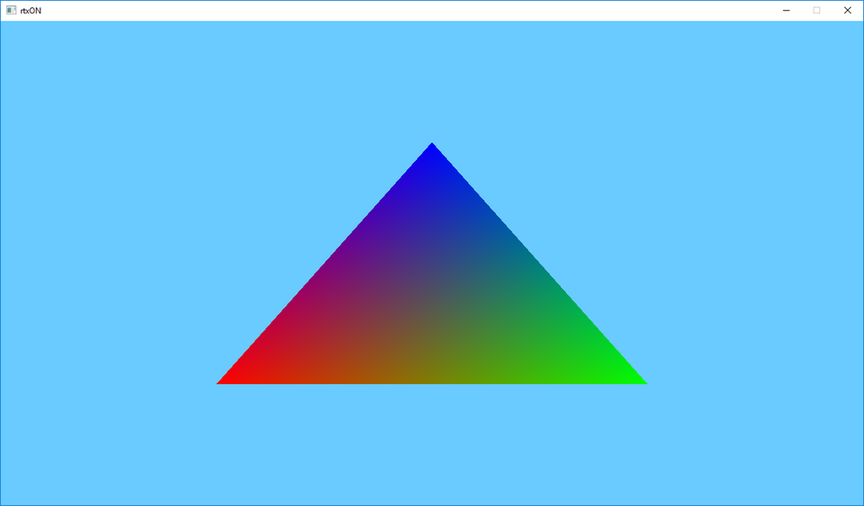

## 0. Pre-intro


What time we live in! It seemed that not so long ago we were waiting for hours for the CPU to calculate this famous image by Turner Whitted, and today we have consumer models of video cards with hardware support for ray tracing that are available to us!

Every computer graphics programmer will tell you that he has dreamed about this day, when we can finally trace rays in world space in real time.
Well, let's see what we need for this and how to start using the technology entrusted to us

At the time of writing this article, only Nvidia has a specialized hardware solution for ray tracing on the GPU - its name is RTX. AMD is betting on its open-source Radeon Rays framework, which, in essence, is a set of compute shaders.

In this article we will be using a solution from Nvidia. Hardware ray tracing is supported by the GPUs based on Volta and Turing architectures. On the part of the graphic API, hardware ray tracing is supported by DirectX 12 (DXR) and Vulkan (through the VK_NVX_raytracing extension).

It is important to note that both of these APIs are not much different, since both were designed by Nvidia. This means that everything considered in the article will be valid for both APIs.

I chose Vulkan extension because:

1. I know Vulkan better than DirectX 12
2. DXR requires (at the moment of writing this article) specific Windows 10 builds, and I’m too lazy for that.


## 1. Intro

The new ray tracing extension brings us some new elements to work with:

- **Acceleration structures** - are special objects that encapsulate the internal representation of the geometry for tracing. You can imagine this as a Bounding Volume Hierarchy (BVH) to speed up the the intersection of the ray and geometry.
- **The Shader Binding Table** (**SBT**) -  is a data structure that allows you to pass multiple shaders to the API for tracing (or its individual stages), and then dynamically invoke those shaders from the table.
- The new trace command - **vkCmdTraceRaysNVX** - very similar to the compute shader dispatch command (vkCmdDispatch).
- The new **Ray tracing pipeline**, that is able to work with shader binding table.

The description of the new elements may seem confusing or complicated to you, but most likely, this is my fault, because in fact, everything is quite simple and intuitive.

Let's briefly look individually at all of these innovations.

### Acceleration structures.

So, let’s start with the acceleration structure (AS) to see what it is and how to work with it.

In order to find intersections with geometry as quickly as possible, we need some kind of data structure that has spatial information about the geometry and allows us to quickly discard those parts of the scene that obviously do not intersect with the ray.

As the simplest example, one can imagine a bounding volumes hierarchy (BVH) represented by parallelepipeds. Thus, by testing the ray for intersection with parallelepipeds, we can reduce the intersection test with geometry to a small set of primitives, without going through the whole scene.

Both of our APIs provide 2 levels of AS - **BLAS** and **TLAS**.

- **BLAS** - Bottom Level Acceleration Structure, which contains geometry itself.
- **TLAS** - Top Level Acceleration Structure - contains one or more BLAS, as well as information about their transformation.

The BLAS are placed inside the TLAS using instancing , so that the BLAS can be duplicated by giving the instance a handle to the BLAS and a separate transformation.

### Shader Binding Table.

So what is the Shader Binding Table (SBT) and what do we need it for?

To begin, let's look at the new shader stages:

- **Raygen** is a shader responsible for generating rays and invoking traces (a traceNVX function in GLSL). Required.
- **Intersection** - a shader that implements the intersection test of the ray and geometry. It allows us to trace user-defined primitives (for example, geometry defined by splines). Optional, the implementation of the intersection of the ray with the triangle will be used.
- **Any-hit** and **Closest-hit** - will be invoked if the intersection with the primitive was found. Since primitives won’t be always be sorted along the ray, several intersections may be reported. Any-hit shader will be invoked for all of them, while the Closest-hit shader will be called at the very end, where the closest to the origin point intersection will be selected. Any-hit shader is optional, Closest-hit shader is required.
- **Miss-shader** - this shader is invoked if the intersection was not found (within [tmin; tmax]). You can use it to return the color of the sky, for example. Optional.

As you can see - 5 additional shader stages were added, using these you can implement any existing ray tracing algorithm.

These shaders are divided into 3 functional subsets:

- **Raygen** - this includes the shader of the same name. There is only one shader of this subset for each trace start (vkCmdTraceRaysNVX function)
- **Intersection** - this subset includes the Intersection shader, Any-hit shader and Closest-hit shader.
- **Miss** - this subset contains only one Miss shader.


Now we can figure out why we need SBT. Let's imagine the simplest raytracer that calculates the direct lighting only.
In the simplest case it might look like this:

```
for each pixel on screen {
    generate ray
    trace ray
    if wasHit(ray) {
        lighting = 0
        for each light {
            generate secondaryRay
            trace secondaryRay
            if not wasHit(secondaryRay) {
                lighting += calcLighting(light)
            }
        }
        ray.color *= lighting
    }
    resultImage[pixel] = ray.color
}
```

Here we can see the use of the Raygen shader to generate rays, Closest-hit and Miss shaders to get color at the point of intersection (or the sky in case of a miss). The Closest-hit shader can contain relatively complex code for reading the necessary information and calculating the color at the point of intersection. Miss shader, for example, can calculate the color from the environment map.

These are the shaders for so-called primary rays. If an intersection with the geometry is found, we generate secondary rays to check the visibility of light sources at the point if intersection (if the light source is not visible - we consider it as a shadow). For better performance we can use simpler Closest-hit and Miss shaders, which will simply set a flag indicating whether the intersection occured.

For this purpose, the *traceNVX* function in the shader takes as an argument the group index within the subset. The shaders themselves, grouped together, are in the SBT table.

Confused? Maybe a bit, but I will try to explain SBT by building it for the example above.

So we have 5 shaders: 1 Raygen, 2 Closest-hit and 2 Miss. As we already know, they belong to different subsets. Let's create groups for our shaders and build SBT.

First we have Raygen shader, he will be in the first group #0. Next come 2 Closest-hit shaders, they will take groups #1 and #2 respectively. The remaining 2 Miss shaders will be in groups #3 and #4.

To make it even clearer, let's add an Any-hit shader for secondary rays (we don’t have to find the nearest intersection after all, only the fact of blocking the light source is important for us). This shader will be included in group #2 as it belongs to a subset of Intersection shaders, like the Closest-hit.



As it can be seen from my perfect drawing - in order for the *traceNVX* function to call shaders for the primary rays, we need to specify the indices of the corresponding groups within the corresponding subset. Shaders for processing intersections for the primary rays are in group #1, which, in turn, is the first in its subset, which means its index is 0. The same is true for group #3, which contains a miss shader for primary rays.

For secondary rays, we, respectively, need groups #2 and #4, whose indices are 1 and 1.
As you can see from this example, each Intersection group can contain from one to 3 shaders (Intersection, Closest-hit and Any-hit).

This mechanism allows you to have a set of specialized shaders for different stages of your raytracer, and you can decide for yourself which one to use, which is very convenient.

### vkCmdTraceRaysNVX и Raytracing pipeline.

We have finished with the most complex and confusing part, now let’s briefly examine the remaining 2 elements.

**vkCmdTraceRaysNVX** is very similar in its essence to vkCmdDispatch. The difference is that vkCmdTraceRaysNVX starts execution on a two-dimensional grid and without splitting into groups (at least, not explicitly). It also takes as starting parameters the offsets for each group of shaders in the buffer containing SBT.

**Ray tracing pipeline** keeps the relations between shaders and their corresponding groups. So in the simplest case you can imagine that SBT is a buffer that contains shaders, than the  Raytracing pipeline will be a description of which of the shaders in this buffer belongs to which group.


## 2. Code

If you still reading this then either I’m not so bad at explanations or your curiosity is very strong ;)
Well, I have good news for you - it’s time for the code. Let’s apply our new knowledge in practice.

Just a quick note - this article is is about the new ray tracing functionality, and is written for people familiar with Vulkan, shaders, and graphics programming in general.
Before proceeding I recommend to go through the these wonderful Vulkan lessons https://vulkan-tutorial.com.

Let's start with a “Hello, World!” in the  computer graphics world - a colorful triangle!
Let's look at the main steps:

- Create a scene: generate a triangle geometry, create a BLAS for it, create an instance with an identity transformation matrix, create a TLAS that’ll contain our instance.
- Load up our shaders and create Raytracing pipeline, indicating which shader belongs to which group.
- Create an SBT and load shaders information from the Raytracing pipeline into it.
- Create the required set of descriptor sets for our resources - our TLAS that will be used for tracing, as well as the resulting image into which we will write the calculated color for each pixel.
- After that all we have to do is to fill the command buffer specifying the pipeline, descriptor set and invoking vkCmdTraceRaysNVX.

Well, that sounds easy. Let's code!

We start by creating a scene that contains a simple triangle. For this we need vertices and indices.

```c++
const float vertices[9] = {
        0.25f, 0.25f, 0.0f,
        0.75f, 0.25f, 0.0f,
        0.50f, 0.75f, 0.0f
    };

const uint32_t indices[3] = { 0, 1, 2 };
```

We load them into the corresponding vertex and index buffers. This is very convenient as we can share this data between rasterization and ray tracing without the need to duplicate it.

Then we need to fill in the appropriate fields of the new structure *VkGeometryNVX*, specifying the vertex and index buffers, the number and size of the vertices, as well as the format of the vertices and indices. All these parameters are exactly the same as for rasterization.

Let’s put our geometry aside while we create our BLAS and TLAS.

To create AS we need to allocate memory for it. First create a new AS object using the new *vkCreateAccelerationStructureNVX* function. Here we can specify what type of AS we want to create - the upper or lower level. To find out how much memory we need to allocate a new function *vkGetAccelerationStructureMemoryRequirementsNVX* is introduced.
Then we bind the allocated memory to the AS using function *vkBindAccelerationStructureMemoryNVX*.

Our AS is ready for construction. To build an AS a driver needs a scratch memory for work, and we must also allocate it ourselves (as elsewhere in Vulkan). To find out the requirements for this buffer we will use the *vkGetAccelerationStructureScratchMemoryRequirementsNVX* function.
Since AS is built on the GPU we need a command buffer.

Now having all this on our hands we can build our AS.

```c++
vkCmdBuildAccelerationStructureNVX(commandBuffer,
                                   VK_ACCELERATION_STRUCTURE_TYPE_BOTTOM_LEVEL_NVX,
                                   0, VK_NULL_HANDLE, 0,
                                   1, &geometry,
                                   0, VK_FALSE,
                                   mScene.bottomLevelAS[0].accelerationStructure, VK_NULL_HANDLE,
                                   scratchBuffer.GetBuffer(), 0);

vkCmdPipelineBarrier(commandBuffer, VK_PIPELINE_STAGE_RAYTRACING_BIT_NVX, 
VK_PIPELINE_STAGE_RAYTRACING_BIT_NVX, 0, 1, &memoryBarrier, 0, 0, 0, 0);
```

Please note that here we explicitly specify our previously created geometry and quantity. In our case this is just one triangle.

Now we need to build a top-level AS (TLAS). As we already know TLAS, in fact, is a container for one or multiple BLAS, which are placed inside it using instancing. To do this we need to fill out the VkGeometryInstance structure for each BLAS instance, specifying the corresponding AS and transformation matrix.

The resulting array of instances must be loaded into the buffer.

> Note: at the moment of writing the VkGeometryInstance structure was absent from Vulkan headers, so I had to declare it myself, using a description from DXR. This should be fixed in later versions of Vulkan SDK.

To build TLAS we need to repeat all the same steps as for building the BLAS. The differences will be in the parameters of the called functions. So when calling vkCreateAccelerationStructureNVX we indicate that we want to create a top-level AS, and when calling vkCmdBuildAccelerationStructureNVX we need to specify a buffer with instances instead of geometries.

The next step will be loading our shaders and creating the ray tracing pipeline. For our example we need 3 shaders: *ray_gen.glsl*, *ray_chit.glsl* and *ray_miss.glsl*. Each with its own stage:

```c++
vulkanhelpers::Shader rayGenShader, rayChitShader, rayMissShader;
rayGenShader.LoadFromFile((sShadersFolder + "ray_gen.bin").c_str());
rayChitShader.LoadFromFile((sShadersFolder + "ray_chit.bin").c_str());
rayMissShader.LoadFromFile((sShadersFolder + "ray_miss.bin").c_str());

std::vector<VkPipelineShaderStageCreateInfo> shaderStages({
    rayGenShader.GetShaderStage(VK_SHADER_STAGE_RAYGEN_BIT_NVX),
    rayChitShader.GetShaderStage(VK_SHADER_STAGE_CLOSEST_HIT_BIT_NVX),
    rayMissShader.GetShaderStage(VK_SHADER_STAGE_MISS_BIT_NVX)
});
```

Now we need to specify the group numbers for each of them. In our case everything is simple: only 3 groups with numbers 0, 1 and 2, respectively.

Also here we will create a set of descriptor sets for our shader resources. We have two resources: it is our TLAS, representing the scene to be traced, and the output image for the results of tracing.

Now we fill in the *VkRaytracingPipelineCreateInfoNVX* structure specifying our shader stages and their group numbers, as well as our descriptor set, and calling the *vkCreateRaytracingPipelinesNVX* function to create a ray tracing pipeline.

The final step is to create a shader binding table (SBT). As I’ve mentioned earlier - SBT is just a buffer that contains groups of shaders (more precisely, handles to them). That means we need to create a buffer of size “number of groups * size of group”. Group size can be requested from device that can fill the *VkPhysicalDeviceRaytracingPropertiesNVX* structure.

After creating the buffer we fill it with groups of shaders that we specified at the time of creating the pipeline. We can use *vkGetRaytracingShaderHandlesNVX* function for this:

```c++
void* mem = mShaderBindingTable.Map(shaderBindingTableSize);
vkGetRaytracingShaderHandlesNVX(mDevice, mRTPipeline, 0, numGroups, shaderBindingTableSize, mem);
mShaderBindingTable.Unmap();
```

So we are ready to start ray tracing! We should use *vkCmdTraceRaysNVX* function for this. It takes an SBT buffer as well as offsets to the first group of each of the shader subsets as a parameters.

```c++
void vkCmdTraceRaysNVX(VkCommandBuffer commandBuffer,
                       VkBuffer        raygenShaderBindingTableBuffer,
                       VkDeviceSize    raygenShaderBindingOffset,
                       VkBuffer        missShaderBindingTableBuffer,
                       VkDeviceSize    missShaderBindingOffset,
                       VkDeviceSize    missShaderBindingStride,
                       VkBuffer        hitShaderBindingTableBuffer,
                       VkDeviceSize    hitShaderBindingOffset,
                       VkDeviceSize    hitShaderBindingStride,
                       uint32_t        width,
                       uint32_t        height);
```

As you can see here - we can use different buffers for different shader groups. In our case we have only one SBT buffer.

*Raygen* shader is located in group #0, and so it’s offset equals zero.
*Miss* shader is located in the second group (#2) and it’s offset equals “2 * group_size“.
*Hit* shader is located in the first group (#1) and so it’s offset equals “group_size”.

The last two parameters are the width and height of our “screen”. The Raygen shader will be called once for each “pixel”  (width x height  times).

Let’s quickly run through our shaders code and we can finally run our amazing ray tracer!

### ray_gen.glsl

```c++
#version 460
#extension GL_NVX_raytracing : require

layout(set = 0, binding = 0) uniform accelerationStructureNVX Scene;
layout(set = 0, binding = 1, rgba8) uniform image2D ResultImage;

layout(location = 0) rayPayloadNVX vec3 ResultColor;

void main() {
    const vec2 uv = vec2(gl_LaunchIDNVX.xy) / vec2(gl_LaunchSizeNVX.xy - 1);

    const vec3 origin = vec3(uv.x, 1.0f - uv.y, -1.0f);
    const vec3 direction = vec3(0.0f, 0.0f, 1.0f);

    const uint rayFlags = gl_RayFlagsNoneNVX;
    const uint cullMask = 0xFF;
    const uint sbtRecordOffset = 0;
    const uint sbtRecordStride = 0;
    const uint missIndex = 0;
    const float tmin = 0.0f;
    const float tmax = 10.0f;
    const int payloadLocation = 0;

    traceNVX(Scene,
             rayFlags,
             cullMask,
             sbtRecordOffset,
             sbtRecordStride,
             missIndex,
             origin,
             tmin,
             direction,
             tmax,
             payloadLocation);

    imageStore(ResultImage, ivec2(gl_LaunchIDNVX.xy), vec4(ResultColor, 1.0f));
}
```

The line “*#extension GL_NVX_raytracing : require*” tells the compiler that we want to use the ray tracing extension.

You may also have noticed several new types and global variables.
The new resource type - *accelerationStructureNVX* - allows you to pass our TLAS, that represents our scene, to the shaders.

*rayPayloadNVX* is the declaration of ray data storage, and the ray payload itself will be passed on to the intersection and miss shaders. In our case it’s a simple vec3 for the color.

```c++
const vec2 uv = vec2(gl_LaunchIDNVX.xy) / vec2(gl_LaunchSizeNVX.xy - 1);
```

Here we calculate the normalized pixel coordinates on our “screen”. *gl_LaunchIDNVX* contains the index of the current thread of execution, like gl_GlobalInvocationID in compute shaders.

*gl_LaunchSizeNVX* contains the same width and height that we specify when calling *vkCmdTraceRaysNVX*.
We use them in order to get the normalized coordinates in the “screen space”. We do this because we specified our triangle vertices coordinates in a normalized screen space coordinates.
We use these coordinates to get the starting point of our ray.

```c++
const vec3 origin = vec3(uv.x, 1.0f - uv.y, -1.0f);
```

We “flip” Y coordinate, because in Vulkan’s coordinate system the screen’s Y goes from top to bottom. If we don’t do this, then our image will look “upside down”.
We also “move back” a little by using -1 as the Z coordinate, so that the triangle appears in front of us.

```c++
const vec3 direction = vec3(0.0f, 0.0f, 1.0f);
```

We set the direction of our ray to be straight ahead along the Z axis.

```c++
const uint rayFlags = gl_RayFlagsNoneNVX;
const uint cullMask = 0xFF;
const uint sbtRecordOffset = 0;
const uint sbtRecordStride = 0;
const uint missIndex = 0;
const float tmin = 0.0f;
const float tmax = 10.0f;
const int payloadLocation = 0;
```

The ray flags and the cull mask are left default for the time being, we will return to them when we perform more advanced ray tracing.

The *sbtRecordOffset* и *sbtRecordStride* parameters are needed to set the index and size of the intersection shader group in our SBT. We sorted out earlier the determination of these indexes.

The *missIndex* specifies the index of our miss shaders group.

The *tmin* and *tmax* values define a segment of our ray, inside which the intersection search will take place. You can think of it as a znear and zfar clipping planes.

And finally, the *payloadLocation* parameter determines the location of the ray payload. This allows you to have several ray payloads for different shaders, and tell the trace function which one  to use in which case.
In our case, we have only one payload - ResultColor, and its location is 0.

After calling the *traceNVX* function, the values ​​in the ray payload (in our case, this is ResultColor) will be changed to the values ​​that the intersection or miss shaders recorded there.

```c++
imageStore(ResultImage, ivec2(gl_LaunchIDNVX.xy), vec4(ResultColor, 1.0f));
```

In our case, we simply write the resulting color to the output image using *gl_LaunchIDNVX* as the pixel coordinates.

### ray_chit.glsl

```c++
#version 460
#extension GL_NVX_raytracing : require

layout(location = 0) rayPayloadInNVX vec3 ResultColor;
layout(location = 1) hitAttributeNVX vec2 HitAttribs;

void main() {
    const vec3 barycentrics = vec3(1.0f - HitAttribs.x - HitAttribs.y, HitAttribs.x, HitAttribs.y);
    ResultColor = vec3(barycentrics);
}
```

Here we can see the new *rayPayloadInNVX* decoration, which points to the ray payload input data. It’s location must match the one specified when calling the traceNVX function.

The *hitAttributeNVX* allows shader to accept the intersection data that the intersection shader defines. A standard built-in triangle intersection shader outputs only the barycentric coordinates of the intersection point. You can use them to get any data you may need by simply interpolating the values ​​of the vertices of the triangle.
In our case we just write the barycentric coordinates as the output color.

### ray_miss.glsl

```c++
#version 460
#extension GL_NVX_raytracing : require

layout(location = 0) rayPayloadInNVX vec3 ResultColor;

void main() {
    ResultColor = vec3(0.412f, 0.796f, 1.0f);
}
```

This shader looks like a simplified copy of the intersection shader. Here we do not calculate anything, but simply return a constant color. This will set the background color of our triangle.

To compile these shaders you should use the *glslangValidator* tool that you can find inside your Vulkan SDK folder.

After successfully compiling the application and all shaders, we can finally admire our unearthly beautiful triangle!



You must agree that no rasterization will allow us to get such a beautiful and physically correct triangle ;)

Well, congratulations! Now you are officially RTX ON!


The source code for this article: [https://github.com/iOrange/rtxON/tree/happy_triangle_fixed](https://github.com/iOrange/rtxON/tree/happy_triangle_fixed)
