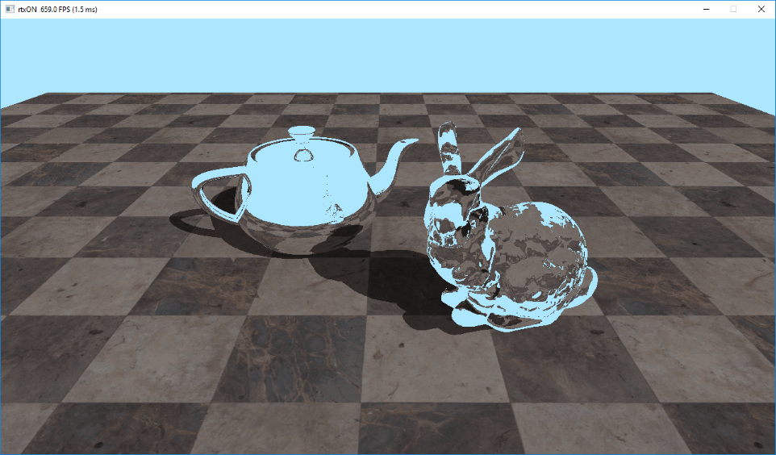
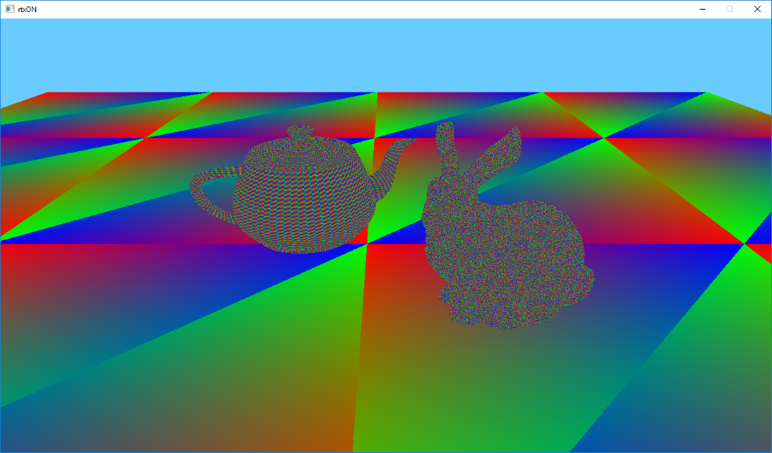
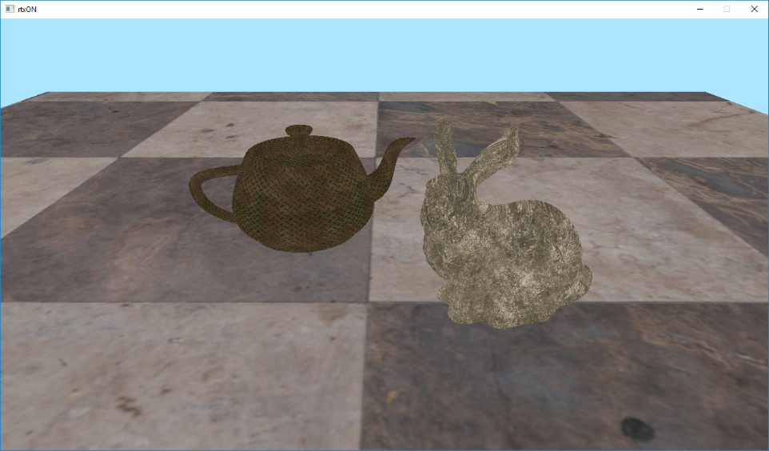
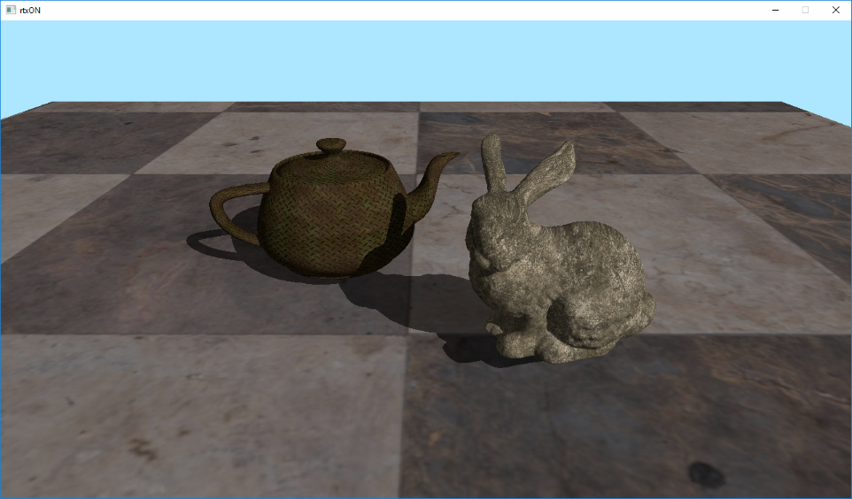
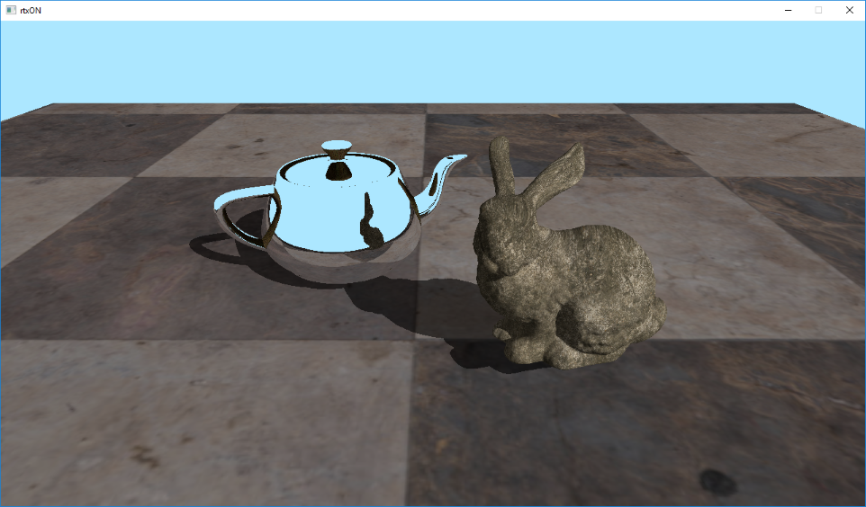
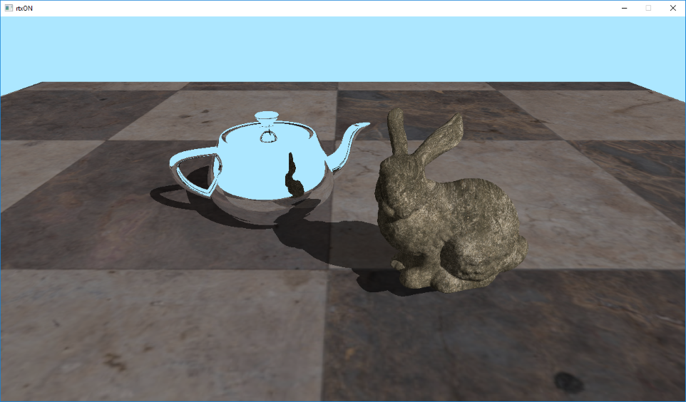

## 0. Greetings


Hello everyone!

Last time we examined what Vulkan Ray Tracing is and how to work with it. The result of that article was a simple application that, nevertheless, creates a scene, pipeline, shaders, and displays the result of ray tracing on this scene.

And even though our triangle turned out to be an order of magnitude more realistic than a rasterized one, I would still like to see ray tracing in all its glory, that’ll also somewhat justify all that money spent on an RTX video card ;)

Well, today I will tell you how to get the result shown in the title picture for this article.


> Quick side note - the purpose of the article is to show how to use Vulkan to build a full-fledged raytracer, to show the main architectural points, and to give some tips on writing effective shaders for ray tracing.

## 1. Bunny and teapot

First of all, we need the scene itself. I took the liberty to prepare a rethought version of the classic icon of ray tracing - Turner Whitted’s scene *“Mirror and glass balls over a piece of vinyl”*. In our case, the scene is called - *“Chrome teapot and and ice rabbit on the marble floor”*.

The rabbit model (Stanford Bunny) was borrowed from here ([https://casual-effects.com/g3d/data10/index.html#mesh3](https://casual-effects.com/g3d/data10/index.html#mesh3)). I used the built-in teapot model  in 3DS Max. The floor model was masterfully made by the author himself. Textures taken from [https://texturehaven.com](https://texturehaven.com)

I’m using [tinyobjloader](https://github.com/syoyo/tinyobjloader "tinyobjloader") library to load the scene. Legendary [stb_image](https://github.com/nothings/stb "stb_image") library is used to load textures.

Also, for more convenient work with the scene and its resources, I’ve added some helper structures: *RTAccelerationStructure*, *RTMesh*, *RTMaterial*, *RTScene*.

The code, for the most part, remains unchanged, only instead of one BLAS, we now have multiple, and therefore multiple *VkGeometryNV* and *VkGeometryInstance* are created. It is also important to note that we assign the object ordinal number in the scene to the instanceId field of each instance. This will help us in the future to access its attributes. After the creation of BLAS and instance for each object of the scene, we build a TLAS. Our scene is ready.

## 2. Camera, action!

Orthographic projection was enough for our triangle, where all the rays were parallel. To see our new scene in all its glory, we need a perspective camera. We will not be engaged in modeling a real lens, but will focus on a simple pinhole camera. In such camera model, our rays exit from one point (the position of the observer) and diverge, forming a pyramid.

The formation of rays for each pixel of our “screen” in this case is very simple - the starting point is always at the observer's position, and the end point is the projection onto the far clipping plane (base of the pyramid).

I added a Camera class to the framework that implements all the methods we need and allows us to control the camera using user input.

To transfer camera parameters to shader, we will use Uniform Buffer Object (UBO) with the next layout:
```c++
struct UniformParams {
    vec4 camPos;
    vec4 camDir;
    vec4 camUp;
    vec4 camSide;
    vec4 camNearFarFov;
};
```

To calculate the ray direction, we need camera’s basis (vectors up, side and forward) and a FOV (field of view). Using FOV and aspect ratio, we can calculate the pyramid’s base (camera’s plane). Using camera’s axises and our screen UV (normalized pixel coordinates) we can finally calculate ray’s direction for a given pixel.
```c++
vec3 CalcRayDir(vec2 screenUV, float aspect) {
    vec3 u = Params.camSide.xyz;
    vec3 v = Params.camUp.xyz;

    const float planeWidth = tan(Params.camNearFarFov.z * 0.5f);

    u *= (planeWidth * aspect);
    v *= planeWidth;

    const vec3 rayDir = normalize(Params.camDir.xyz + (u * screenUV.x) - (v * screenUV.y));
    return rayDir;
}
```

Now, if we launch our application, we should see the following picture.


Now, instead of one colored triangle, we have several hundred thousands of colored triangles on the screen. All glory to raytracing!

## 3. Metal and marble

Colored triangles are nice, of course, but how about textures? Fortunately, texturing our triangles is not much different from that in rasterization - we still need texture coordinates for each vertex of the triangle, their interpolated value for the pixel in question, as well as the texture and a sampler itself.

To interpolate our texture coordinates (as well as any other vertex attribute), we will need the those barycentric coordinates that we were displaying as a color. But where do we get vertex attributes? For rasterization, we add vertex attributes to the vertex buffer, and then the pipeline does everything for us, but in the case of ray tracing, we need to do this ourselves. The good news is that it’s quite simple!

Shader Storage Buffer Object (SSBO, or StructuredBuffer in DirectX terminology) will be useful for transferring attributes to the shader. We add vertex attributes to SSBO and pass them to the shader. Looks easy, but how do we know which vertices we need to grab? First we need to know which triangle we hit, and luckily there’s **gl_PrimitiveID** to help us with this, which contains the ordinal number of the triangle for the given object. That’s much better, but most often our geometry is indexed to avoid duplication of the data, which means we will also need indices, that we will also pass using SSBO.

So, we have the a triangle id, using it we can read the indices, with the help of which we can read our vertex attributes, and, after barycentric interpolation, we can finally sample the texture. But how do we know which one? For this we will use another SSBO buffer that contains texture index for each triangle of the mesh. We will use already familiar to us *gl_PrimitiveID* to access it.

So let's write down the list of buffers we will use:

- **MaterialsIDs** (SSBO, material index for each triangle)
- **FacesBuffer** (SSBO, vertex indexes)
- **AttribsBuffer** (SSBO, vertex attributes)
- **Texture** (sampler2D, texture)

But we have multiple objects in the scene, what about this? Fortunately for us, there is **VK_EXT_descriptor_indexing** extension, that adds a lot of goodies and relaxes for descriptors, but the most important thing for us, is that when we create descriptor set layout, we can indicate variable numbers of bindings. Thus, we can bind as many resources as we want, which is just perfect for our situation!
I will not discuss this extension in details, it is beyond the scope of this article, so for further reference you can follow this link - [https://www.khronos.org/registry/vulkan/specs/1.1-extensions/html/vkspec. html#VK_EXT_descriptor_indexing](https://www.khronos.org/registry/vulkan/specs/1.1-extensions/html/vkspec. html#VK_EXT_descriptor_indexing)

Do you remember that instanceId field we assigned for each instance? So here it is now useful for us to access the correct buffer from the array! For this we will use another built-in variable **gl_InstanceCustomIndexNV**, that contains our value.
This is what our texturing code will look like:
```c++
const vec3 barycentrics = vec3(1.0f - HitAttribs.x - HitAttribs.y, HitAttribs.x, HitAttribs.y);
const uint matID = MatIDsArray[nonuniformEXT(gl_InstanceCustomIndexNV)].MatIDs[gl_PrimitiveID];
const uvec4 face = FacesArray[nonuniformEXT(gl_InstanceCustomIndexNV)].Faces[gl_PrimitiveID];
VertexAttribute v0 = AttribsArray[nonuniformEXT(gl_InstanceCustomIndexNV)].VertexAttribs[int(face.x)];
VertexAttribute v1 = AttribsArray[nonuniformEXT(gl_InstanceCustomIndexNV)].VertexAttribs[int(face.y)];
VertexAttribute v2 = AttribsArray[nonuniformEXT(gl_InstanceCustomIndexNV)].VertexAttribs[int(face.z)];

const vec2 uv = BaryLerp(v0.uv.xy, v1.uv.xy, v2.uv.xy, barycentrics);
const vec3 texel = textureLod(TexturesArray[nonuniformEXT(matID)], uv, 0.0f).rgb;
```

As you can see, it turns out to be not that difficult, and is very flexible.
Run the application to see the following image:


Looks way better already, but something is missing … Oh yeah! The lighting!

## 4. Turn on the light!

Let's add the simplest lighting, the classics of computer graphics - the Lambertian diffuse lighting model. According to this model, the light is scattered evenly over the hemisphere, and the illumination only depends on the angle between the incoming light and surface normal.
Or in simple terms - mister **N dot L**.

And this is where ray tracing shows it’s advantages over rasterization - shadows! A point is in the shadow, if it does not “see” the light source directly, and it is very easy to check this with ray tracing — all you have to do is to shoot a ray in the direction of the light source and see if it hits anything on its way. If an intersection is found, then the light source is blocked and we are “in shadow”. If there was no intersection, then we are lit.

To do all this, after we found the primary intersection, we need to build a new ray that’ll point towards the light source, and call **traceNV** again. This can also be done in the Hit shader, but it is recommended to keep all traceNV calls inside the Raygen shader, as this allows the scheduler to work with it’s maximum efficiency.

Another optimization is to use the smallest possible *RayPayload*, as well as specialized Hit and Miss shaders. For the “shadow” rays payload we need only a single value that’ll tell us whether we hit something or not.

Let's modify our Raygen shader:
```c++
const vec3 hitColor = PrimaryRay.colorAndDist.rgb;
const float hitDistance = PrimaryRay.colorAndDist.w;
const vec3 hitNormal = PrimaryRay.normal.xyz;
float lighting = 1.0f;
// if we hit something
if (hitDistance > 0.0f) {
    const vec3 hitPos = origin + direction * hitDistance;
    const vec3 toLight = normalize(Params.sunPosAndAmbient.xyz);
    const vec3 shadowRayOrigin = hitPos + hitNormal * 0.01f;
    const uint shadowRayFlags = gl_RayFlagsOpaqueNV | gl_RayFlagsTerminateOnFirstHitNV;
    const uint shadowRecordOffset = 1;
    const uint shadowMissIndex = 1;
    traceNV(Scene,
            rayFlags,
            cullMask,
            shadowRecordOffset,
            stbRecordStride,
            shadowMissIndex,
            shadowRayOrigin,
            0.0f,
            toLight,
            tmax,
            SWS_LOC_SHADOW_RAY);
    if (ShadowRay.distance > 0.0f) {
        lighting = Params.sunPosAndAmbient.w;
    } else {
        lighting = max(Params.sunPosAndAmbient.w, dot(hitNormal, toLight));
    }
}
```

> Please note that for the “shadow” rays we add **gl_RayFlagsTerminateOnFirstHitNV** flag. In this case, we will stop tracing at the first found intersection, without finding the nearest one. It’s only a fact of an occlusion is important to us, after all.

So here we check if there was a primary intersection, or if we hit the “sky”. If there was an intersection - then we calculate the intersection point (we know the distance to the intersection point from the ray origin), then get the direction to the light source, and call *traceNV*, specifying our specialized “shadow” shaders, as well as the location of *PayLoad* for “shadow” rays.


> Please note that we slightly offset our shadow ray origin along the normal. This is done to avoid unwanted “self-shadowing”. You can also use a non-zero tmin value for this.

After that, we check if there was an intersection, and if it wasn’t, then we calculate lighting according to the Lambertian model. If there was an intersection - then we take the constant ambient light value as our lighting.

Despite the simplicity of this lighting model, due to the presence of shadows, we can get a pretty nice picture.


## 5. Mirror

As you may have noticed, ray tracing is a simple, but at the same time, very powerful tool. Using a simple ray intersection mechanism it is possible to implement many features that  can be is either difficult or impossible to implement with rasterization.

Let's look at reflections, for example. Modern rasterization renderers have learned many tricks for building acceptable reflections, but they are all far from realistic and make quite a few assumptions.

With the help of ray tracing, we can get reflections very easily - simply reflect the incoming ray and continue the tracing. Let's try.

To begin with, we will define that our teapot has reflective properties by pretending that it’s  chrome-plated. To do this, we write a flag to RayPayload in the Hit shader - whether we hit the teapot or not (since I created the scene, I know that the serial number of the teapot = 2).

Now all we need to do in the Raygen shader is to check if we hit the teapot, and instead of the “shadow” ray, we shoot another primary ray, reflecting the direction, and use the color at the intersection as a reflection.

```c++
const float isTeapot = PrimaryRay.normal.w;
// if teapot - let's reflect!
if (isTeapot > 0.0f) {
    const vec3 hitPos = origin + direction * hitDistance + hitNormal * 0.01f;
    const vec3 reflectedDir = reflect(direction, hitNormal);
     traceNV(Scene,
            rayFlags,
            cullMask,
            primaryRecordOffset,
            stbRecordStride,
            primaryMissIndex,
            hitPos,
            0.0f,
            reflectedDir,
            tmax,
            SWS_LOC_PRIMARY_RAY);
}
```

We’re using the same RayPayload and the same shaders as for the primary rays, because, in fact, we simply continue to trace the primary ray.
Now we can enjoy the view of our chrome-plated teapot.


As you, probably, could notice - the reflection on our teapot is somehow strange. There is no shadow in the reflection of the floor, and the side and top handles of our teapot were reflected textured. This is because after finding the intersection of the reflected ray, we simply pick up the resulting color and stop there.

First, we need to calculate the lighting at the intersection point at least. And secondly - if we hit the mirror surface again - we need to reflect the ray and continue tracing. Try to put two mirrors in front of each other, and you will see an “infinite” reflection. We can’t afford infinite reflection, of course, but at least several levels of reflections can well be mastered.

## 6. Getting in the loop

We all know that recursion is bad. But recursion on the GPU is even worse. And although Vulkan Ray Tracing allows us to implement recursive tracing, performance-wise it’s not a good idea to do so.

In our case, it is possible to get away with the simple loop. At each iteration, we trace the ray, check where we hit it, and then decide:

- If we hit the “sky” - we exit the loop
- If we hit the teapot - we construct the reflected ray and continue
- If we hit the rest of the scene - calculate the lighting and exit the loop

I imperatively selected the maximum number of iterations equal to 10. This allows you to have a sufficient number of reflections to create a plausible picture, while maintaining good performance.

Let's change our shader according to the described algorithm:
```c++
vec3 finalColor = vec3(0.0f);
for (int i = 0; i < SWS_MAX_RECURSION; ++i) {
    traceNV(Scene,
            rayFlags,
            cullMask,
            primaryRecordOffset,
            stbRecordStride,
            primaryMissIndex,
            origin,
            tmin,
            direction,
            tmax,
            SWS_LOC_PRIMARY_RAY);

    const vec3 hitColor = PrimaryRay.colorAndDist.rgb;
    const float hitDistance = PrimaryRay.colorAndDist.w;

    // if hit background - quit
    if (hitDistance < 0.0f) {
        finalColor += hitColor;
        break;
    } else {
        const vec3 hitNormal = PrimaryRay.normal.xyz;
        const float isTeapot = PrimaryRay.normal.w;

        const vec3 hitPos = origin + direction * hitDistance;

        if (isTeapot > 0.0f) {
            // our teapot is mirror, so continue

            origin = hitPos + hitNormal * 0.01f;
            direction = reflect(direction, hitNormal);
        } else {
            // we hit diffuse primitive - simple lambertian

            const vec3 toLight = normalize(Params.sunPosAndAmbient.xyz);
            const vec3 shadowRayOrigin = hitPos + hitNormal * 0.01f;

            traceNV(Scene,
                    rayFlags,
                    cullMask,
                    shadowRecordOffset,
                    stbRecordStride,
                    shadowMissIndex,
                    shadowRayOrigin,
                    0.0f,
                    toLight,
                    tmax,
                    SWS_LOC_SHADOW_RAY);

            const float lighting = (ShadowRay.distance > 0.0f) ? Params.sunPosAndAmbient.w : max(Params.sunPosAndAmbient.w, dot(hitNormal, toLight));

            finalColor += hitColor * lighting;

            break;
        }
    }
}
```

As a result - we have some good looking reflections:


## 7. Ice

Our raytracer becomes more mature. Now, having our universal tracing loop, we can expand the functionality by adding new materials and more realistic lighting models. With fairly minor changes, you can get a full-fledged path tracer capable of rendering realistic images.

Let's add one more feature of ray tracing - refractions. A thing practically impossible to achieve using rasterization. But, thanks to our tracing loop, we can easily get realistic multi-level refractions. Let's make our rabbit icy!

To do this, we define the constants that contains ids of objects in our scene, and in the intersection shader we will write the id of the object we intersected into RayPayload.
```c++
const float objId = float(gl_InstanceCustomIndexNV);
PrimaryRay.normalAndObjId = vec4(normal, objId);
```

We now need Index Of Refraction (IOR) for our rabbit. I chose an ice, with IOR  of 1.31 ([https://en.wikipedia.org/wiki/List_of_refractive_indices#List](https://en.wikipedia.org/wiki/List_of_refractive_indices#List))
The refract function takes the ratio of the refractive indices of two media, and in our case it is air / ice, so we define it as  1.0 / 1.31
```c++
const float kBunnyRefractionIndex = 1.0f / 1.31f;
```

Now let’s add a check for a bunny to our loop:
```c++
if (objectId == OBJECT_ID_TEAPOT) {
    // our teapot is mirror, so reflect and continue

    origin = hitPos + hitNormal * 0.001f;
    direction = reflect(direction, hitNormal);
} else if (objectId == OBJECT_ID_BUNNY) {
    // our bunny is made of ice, so refract and continue

    const float NdotD = dot(hitNormal, direction);

    vec3 refrNormal = hitNormal;
    float refrEta;

    if(NdotD > 0.0f) {
        refrNormal = -hitNormal;
        refrEta = 1.0f / kBunnyRefractionIndex;
    } else {
        refrNormal = hitNormal;
        refrEta = kBunnyRefractionIndex;
    }

    origin = hitPos + direction * 0.001f;
    direction = refract(direction, refrNormal, refrEta);
}
```

Because our refracted ray “enters” and “exits” the object, we have to detect this, and invert normal and IOR to get proper refraction.

And that’s it! The system we built is very flexible.
Let’s run the application to check the result.

> Note that I also modified texture coordinates of the floor, to make it look a bit better.


Wow, we made a long way from a simple colored triangle to a scene with multiple textured and lit objects, and implemented reflective and refracting surfaces. Using this base, it is already possible to build a more or less serious ray tracer / path tracer.

In the next article we will try to build a hybrid renderer that combines rasterization and ray tracing.

All the source code for the article is here: [https://github.com/iOrange/rtxON/tree/Version_2_2](https://github.com/iOrange/rtxON/tree/Version_2_2)
